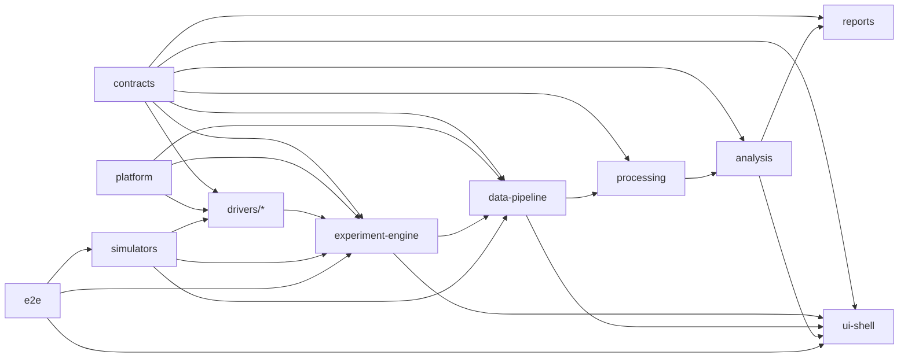
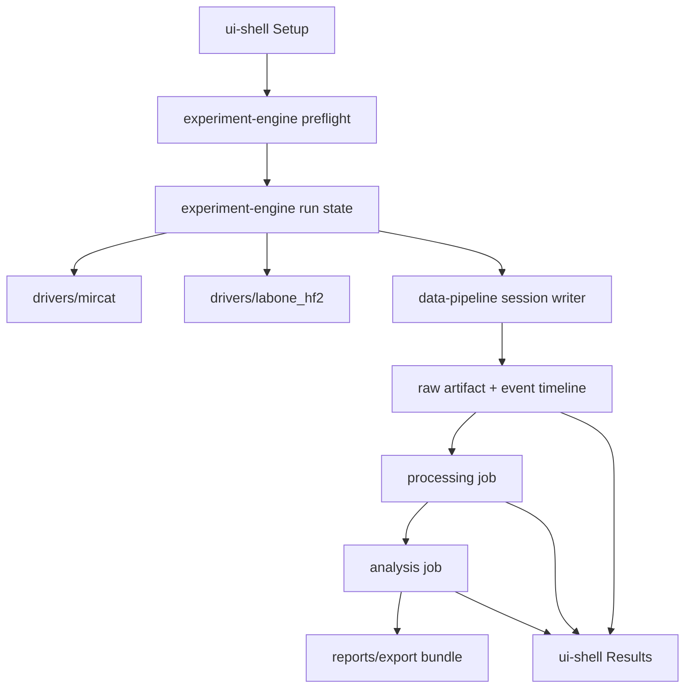

# Legacy to Target Mapping

This document maps the useful parts of `Control_System` into the target package boundaries defined by `ir_control_platform`. It is package-first rather than screen-first so the next phase can implement boundaries before features.

## Target package dependency graph

### Boundary decisions

- `ui-shell` may present state and issue typed commands, but it must not import drivers or own persistence.
- `experiment-engine` is the sole owner of coordinated run sequencing.
- `data-pipeline` owns raw capture, session manifests, artifact indexing, and replay.
- `processing`, `analysis`, and `reports` must operate on persisted artifacts, not transient page state.

## Current-to-target mapping

| Target package | Legacy sources worth using | What carries forward | What is explicitly rejected | First Phase 2 deliverable |
|---|---|---|---|---|
| `contracts` | `hardware_configuration.toml`, `ExperimentView.tsx`, `ScanModePanel.tsx`, `LaserSettingsPanel.tsx`, `ZurichHF2LIView.tsx`, vendor manuals | Canonical recipe fields, device capability limits, status and fault fields, stream selection semantics, session metadata fields | Browser state models, UI-only labels, auto-correction behavior, raw LabOne node paths as public contracts | Define `ExperimentRecipe`, `DeviceStatus`, `DeviceFault`, `ValidationIssue`, `RunState`, `SessionManifest`, and artifact types |
| `platform` | `backend/src/main.py`, `start.bat`, route startup hooks, error handling patterns | Explicit bootstrap concerns, logging needs, normalized fault envelope, runtime configuration ownership | Module auto-discovery, per-device startup autoconnect, environment mutation as runtime behavior | Establish event, error, logging, and bootstrap primitives |
| `drivers/mircat` | `daylight_mircat/controller.py`, `daylight_mircat/routes.py`, `docs/sdks/daylight_mircat`, `docs/manuals/daylight_mircat` | SDK load rules, vendor call order, status parsing, fault meanings, tune and scan semantics | Route-owned settings persistence, software ping-pong fallback, duplicate scan paths | Define the MIRcat driver contract and normalized faults |
| `drivers/labone_hf2` | `zurich_hf2li/controller.py`, `zurich_hf2li/routes.py`, `docs/manuals/zurich_hf2li`, `docs/sdks/zurich_h2fli` | LabOne connection, device discovery, demodulator semantics, timestamp handling, supported expert operations | UI-owned raw node map, plotter ownership in the UI, MIRcat-derived axis fallback | Define the HF2 driver contract, supported node abstractions, and driver status surface |
| `drivers/picoscope` | `picoscope_5244d/controller.py`, `picoscope_5244d/routes.py`, Pico manuals | Range ladder, timebase mapping, trigger semantics, preview-capture mechanics | Autoset heuristics, immediate-capture fallback, UI-driven polling loops | Define a limited explicit acquisition surface and supported modes |
| `drivers` for Highland devices | `utils/highland_delay.py`, `highland_t660/*`, `highland_t661/*`, Highland manuals | Serial and TCP transport, parser, trigger and channel semantics | Raw command console as a product feature | Define shared Highland transport plus typed per-device driver contracts |
| `experiment-engine` | `backend/src/modules/experiment/routes.py`, selected MIRcat workflow components | The only proven coordinated sequence: start capture, start sweep, monitor, stop, finalize | UI timers, UI-owned readiness checks, route-level orchestrator | Define preflight, run commands, run events, and deterministic run state transitions |
| `data-pipeline` | `zurich_hf2li/controller.py`, `data/*.csv`, `data/*.txt`, `backend/data/raw/*.txt` | Raw capture semantics, comment metadata fields, artifact naming patterns, replay-worthy outputs | Direct file writes from UI flows, plotter buffer as authoritative state | Define session writer, raw artifact registration, replay loader, and partial-run behavior |
| `processing` | `backend/scripts/convert_hf2li.py`, `backend/data/converted/*.txt` | Sample/reference split detection, absorbance formula, filename-derived wavenumber range | Directory watch mode and interactive rename prompts | Define deterministic conversion jobs and recipe versioning |
| `analysis` | `backend/data/converted/*.txt`, `tools/agent_commands.json` | Comparison baselines and minimal summary expectations | Any notion that analysis lives in the screen layer | Define the first derived metrics and comparison contracts later, after processing exists |
| `ui-shell` | `ExperimentView.tsx`, `Statusbar.tsx`, `StatusIndicator.tsx`, screenshots, selected device views as requirement sources | Workflow nouns, visible state categories, expert-only control needs, persistent status visibility | Device-first route tree, provider-driven device ownership, raw node forms, direct orchestration | Define workflow-first route map and page scaffolds with explicit blocked, loading, fault, and recovery states |
| `reports` | `backend/data/converted/*.txt`, result naming expectations in `ExperimentView.tsx` | Reproducible export expectations and completed-run naming concepts | Screen-scrape or page-local export logic | Define export request and result-bundle contracts later |
| `simulators` | `data/`, `backend/data/raw/`, `backend/data/converted/`, `tools/agent_commands.json` | Replay fixtures, golden outputs, command transcript scenarios | Any simulator shortcut that changes production package behavior | Curate deterministic nominal and failure fixtures for the first slice |
| `e2e` | `tools/agent_runner.py`, `tools/agent_commands.json`, replay data | Golden-path and failure-path scenario ideas | Legacy HTTP transport assumptions | Build simulator-backed tests for setup, run, persistence, reopen, and processing |

## Recommended target data-flow map

### Required implications of this flow

- The session record must exist before the run is complete.
- MIRcat and HF2LI become peers controlled by `experiment-engine`, not by each other and not by the UI.
- Wavenumber axis ownership moves into recipe and run metadata, not into live cross-driver reach-through.
- Processing and analysis start from persisted artifacts, so replay and reprocessing work without live hardware.

## First vertical slice mapping

| Slice step | Required target packages | Legacy seeds | Notes |
|---|---|---|---|
| Setup and preflight | `contracts`, `ui-shell`, `experiment-engine` | `ExperimentView.tsx`, `ScanModePanel.tsx`, `HF2SettingsProvider.tsx` | Keep only the fields and readiness concepts, not the state model. |
| Coordinated start and stop | `experiment-engine`, `drivers`, `platform` | `experiment/routes.py`, `daylight_mircat/controller.py`, `zurich_hf2li/controller.py` | This is the single canonical run path for the first slice. |
| Session creation and raw persistence | `data-pipeline`, `contracts` | `start_recording_to_file()`, raw output files, metadata comments | Replace comment-prefixed headers with a proper manifest plus artifact records. |
| Processing and first result | `processing`, `reports`, `ui-shell` | `convert_hf2li.py`, converted fixtures | One deterministic processed artifact is enough for the first slice. |
| Simulator and e2e coverage | `simulators`, `e2e` | `data/`, `backend/data/raw/`, `backend/data/converted/`, `agent_commands.json` | Start simulator-first before touching real bench hardware. |

## No destination in the target repo

These items and patterns do not get a target package destination:

- `frontend/src/App.tsx`
- `frontend/src/components/DashboardView.tsx`
- `frontend/src/components/global/Navbar.tsx`
- `frontend/src/modules/HighlandT660/HighlandT660View.tsx`
- `frontend/src/modules/HighlandT661/HighlandT661View.tsx`
- `frontend/src/utils/useMemoryState.ts`
- `frontend/src/modules/DaylightMIRcat/context/*`
- `frontend/src/modules/ZurichHF2LI/context/HF2SettingsProvider.tsx`
- `backend/src/modules/daylight_mircat/user_settings.json`
- generic node passthrough and raw command endpoints
- any fallback, compatibility, or alternate-path control flow

The replacement is not a one-to-one port. It is a package-first rewrite around explicit boundaries.
