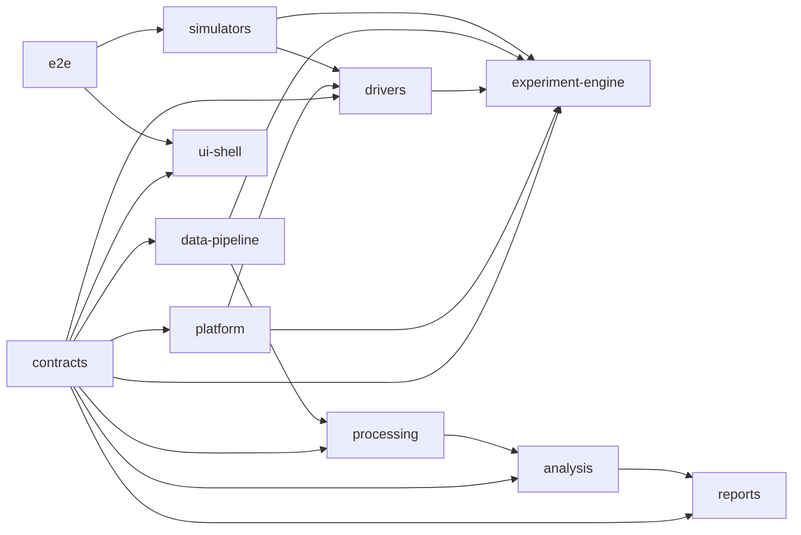

# Package Boundaries

## Purpose
This document records the approved package direction for the supported v1 experiment model and the current operator-first UI plan.

Use it to keep execution order from collapsing ownership.
The next implementation pass is UI-first from a sequencing perspective, not from an ownership perspective.

## Fixed Ownership
Authority remains unchanged:
- `experiment-engine` owns orchestration, validation, commands, and authoritative run state
- `data-pipeline` owns sessions, artifacts, replay, and provenance
- `processing` owns deterministic transforms
- `analysis` owns deterministic interpretation
- `reports` owns export generation
- `ui-shell` consumes typed control-plane and data-plane boundaries

The default `Operate` workflow does not change those boundaries.

## Current Execution Rule
Build the operator-first UI MVP first, then deepen secondary surfaces and backend wiring in response to that reviewed UI.

That means:
- make the default `Operate` workflow clear first
- use `Results`, `Advanced`, and `Service / Maintenance` as secondary surfaces
- keep `Analyze` secondary until persisted-session review is useful
- do not use the UI sequencing rule to move truth into `ui-shell`

## Approved Dependency Direction

## Package Roles

| Package | Owns | Must not own |
|---|---|---|
| `contracts` | Canonical shared types, recipe shape, run state, session manifest, and artifact provenance | Device I/O, orchestration, persistence implementation, UI behavior |
| `platform` | Generic event and error primitives | Device-specific logic or workflow decisions |
| `drivers` | One typed adapter contract per device family | Multi-device coordination, persistence, UI state |
| `experiment-engine` | Preflight, coordinated start and abort flow, run state, device fault projection | Raw file writes, analysis, view logic |
| `data-pipeline` | Session creation, event persistence, artifact registration, reopen and replay | Driver logic, presentation logic |
| `processing` | Deterministic raw-to-processed jobs | Session truth or UI state |
| `analysis` | Deterministic processed-to-analysis jobs | Session truth or UI state |
| `reports` | Export generation from persisted artifacts | Live orchestration or screen-scrape output |
| `ui-shell` | Presentation-facing commands and queries only | Direct driver imports, persistence, processing, or analysis authority |
| `simulators` | Deterministic simulator bundles and scenario catalogs | Production shortcuts |
| `e2e` | Scenario-level verification | Product runtime ownership |

## Operate Workflow Boundary Mapping
For the next UI pass:
- `ui-shell` renders session and sample identity, laser controls, HF2LI acquisition controls, run control, live status, and recent warnings.
- `experiment-engine` owns preflight, coordinated start and abort, timing relationships, and authoritative run state.
- `data-pipeline` owns save and reopen behavior, session manifests, artifact registration, and recent-session summaries.
- `processing`, `analysis`, and `reports` remain outside the default operator path until persisted-session review needs them.

Expanded v1 clarifications remain intact:
- `experiment-engine` owns the neutral T0-based timing model and translates pump-shot count, probe mode, acquisition timing mode, and selected digital references into one coordinated execution path.
- `drivers` own device-specific programming for T660-2, T660-1, PicoScope, and the Arduino-controlled MUX. They do not decide experiment timing relationships.
- `data-pipeline` owns persisted HF2LI primary raw artifacts and any secondary PicoScope monitor artifacts.
- saved settings metadata, raw outputs, and provenance become visible in the UI by reading authoritative control-plane and data-plane state, not by inventing UI-local truth.

## Allowed Support Moves During The UI MVP Pass
These are acceptable:
- thin view-model adapters that reshape authoritative state for server-rendered pages
- minimal read-only storage and session-inspection helpers
- fixture-backed or simulator-backed summaries used to make `Operate` and `Results` reviewable

These are still not acceptable:
- UI-authored run orchestration
- UI-authored persistence truth
- speculative backend implementation added only to populate screens
- duplicated workflow paths split between “real” and “temporary” logic

## Canonical Operate Command Flow
1. `ui-shell` requests session lookup, preflight, or run actions through typed boundaries.
2. `experiment-engine` evaluates the recipe plus current device status and returns readiness or run-state updates.
3. `experiment-engine` requests session creation through `data-pipeline` before a run becomes live.
4. `experiment-engine` applies one coordinated configuration spanning timing, probe operation, HF2LI acquisition, and any optional routing or secondary capture.
5. `data-pipeline` records session updates, raw artifacts, and run events continuously enough that a faulted run can still be reopened.
6. `processing`, `analysis`, and `reports` operate only on persisted artifacts and session manifests.

## Explicit Bans
- No runtime imports or file reads from the legacy migration reference repository.
- No direct `ui-shell` imports of `drivers`, `data-pipeline`, `processing`, or `analysis` implementation packages.
- No startup auto-connect behavior.
- No raw node passthrough surface for HF2LI in the product contract.
- No fallback or alternate sweep path for MIRcat in the canonical design.
- No device-first timing console that bypasses the experiment engine's T0 model.
