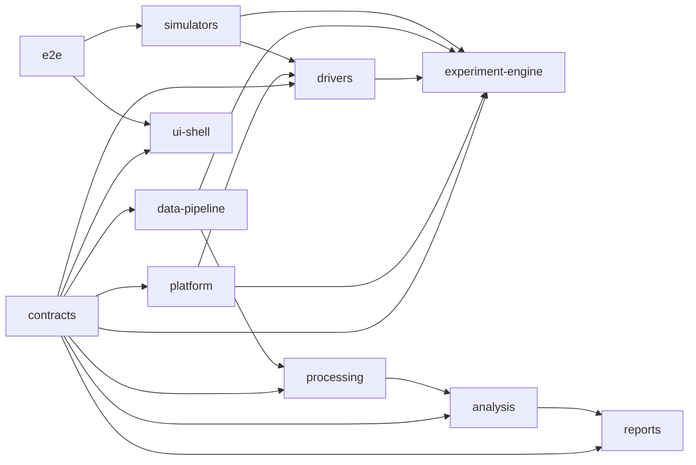

# Package Boundaries

This document records the approved package direction for the supported v1 experiment model. The initial Phase 2 and Phase 3A foundation proved the architecture with a MIRcat + HF2LI-only slice, but the canonical v1 model now also includes T660-2 and T660-1 timing semantics, Nd:YAG timing control mediated by T660-2, Arduino-controlled MUX routing, and PicoScope as a secondary recorded source. The ownership rules remain intentionally strict so later driver, engine, data, and UI work can land without re-litigating authority.

## Approved dependency direction

## Package roles

| Package | Owns | Must not own |
|---|---|---|
| `contracts` | Canonical shared types, recipe shape, run state, session manifest, and artifact provenance | Device I/O, orchestration, persistence implementation, UI behavior |
| `platform` | Generic event and error primitives | Device-specific logic or workflow decisions |
| `drivers` | One typed adapter contract per device family | Multi-device coordination, persistence, UI state |
| `experiment-engine` | Preflight, coordinated start/abort flow, run state, device fault projection | Raw file writes, analysis, view logic |
| `data-pipeline` | Session creation, event persistence, artifact registration, reopen/replay | Driver logic, presentation logic |
| `processing` | Deterministic raw-to-processed jobs | Session truth or UI state |
| `analysis` | Deterministic processed-to-analysis jobs | Session truth or UI state |
| `reports` | Export generation from persisted artifacts | Live orchestration or screen-scrape output |
| `ui-shell` | Presentation-facing commands and queries only | Direct driver imports, persistence, processing, analysis authority |
| `simulators` | Deterministic simulator bundles and scenario catalogs | Production shortcuts |
| `e2e` | Scenario-level verification | Product runtime ownership |

## Boundary clarifications for the expanded v1 slice

- `experiment-engine` owns the neutral T0-based timing model and translates pump-shot count, probe mode, acquisition timing mode, and selected digital references into one coordinated execution path.
- `drivers` own device-specific programming for T660-2, T660-1, PicoScope, and the Arduino-controlled MUX; they do not decide experiment timing relationships.
- `data-pipeline` remains the owner of persisted HF2LI primary raw artifacts and any secondary PicoScope monitor artifacts.
- `ui-shell` presents timing, MUX, and PicoScope choices as experiment controls, not as separate device-first consoles.

## Canonical v1 command flow

1. `ui-shell` requests `run_preflight()` through a control-plane client.
2. `experiment-engine` evaluates `ExperimentRecipe` plus current `drivers` status and returns a `PreflightReport`.
3. `experiment-engine` requests session creation through `data-pipeline` before the run is considered live.
4. `experiment-engine` applies one coordinated configuration spanning T660-2 master timing, T660-1 slave timing, Nd:YAG timing semantics, MIRcat probe operation, HF2LI primary acquisition, and optional MUX plus PicoScope secondary recording.
5. `data-pipeline` records session updates, raw artifacts, optional secondary monitor artifacts, and run events continuously enough that a faulted run can still be reopened.
6. `processing`, `analysis`, and `reports` operate only on persisted artifacts and session manifests.

## Explicit bans

- No runtime imports or file reads from the legacy migration reference repository.
- No direct `ui-shell` imports of `drivers`, `data-pipeline`, `processing`, or `analysis` implementation packages.
- No startup auto-connect behavior.
- No raw node passthrough surface for HF2LI in the product contract.
- No fallback or alternate sweep path for MIRcat in the canonical design.
- No device-first timing console that bypasses the experiment engine's T0 model.

## Phase 2 contract choices

- `ExperimentRecipe` must expand beyond the MIRcat + HF2LI foundation to include T0-based timing, pump/probe/acquisition relationships, MUX selection, optional PicoScope secondary capture, and time-to-wavenumber mapping context.
- `DeviceConfiguration` is the normalized applied snapshot; driver command methods consume typed recipe sections and return normalized snapshots.
- `SessionManifest` is authoritative and versioned from creation onward, even if the run later faults or aborts.
- Raw, processed, analysis, and export artifacts are separate contract types with explicit provenance links; HF2LI remains the primary scientific raw-data source and PicoScope remains a secondary recorded monitor source.
