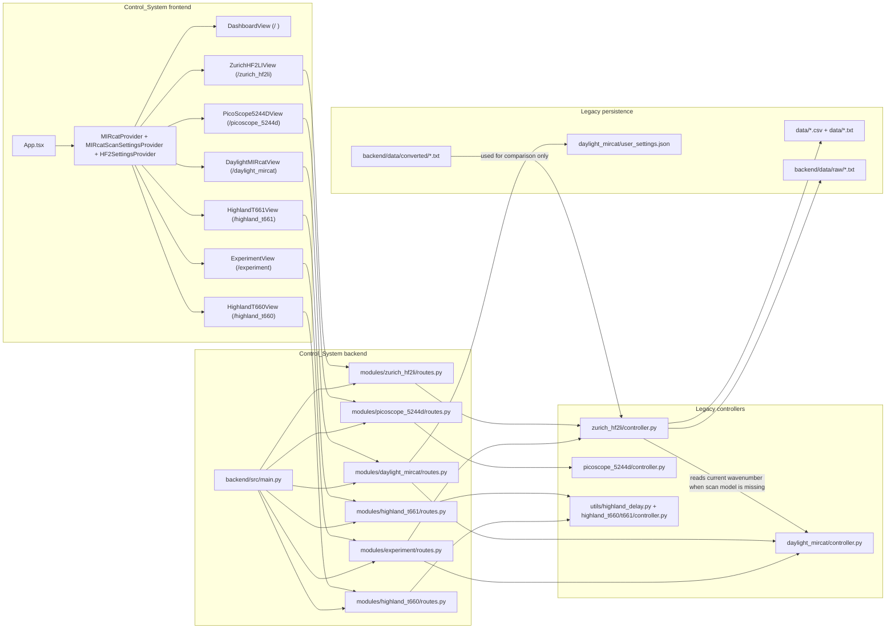
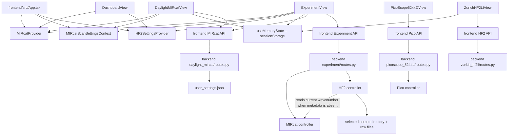
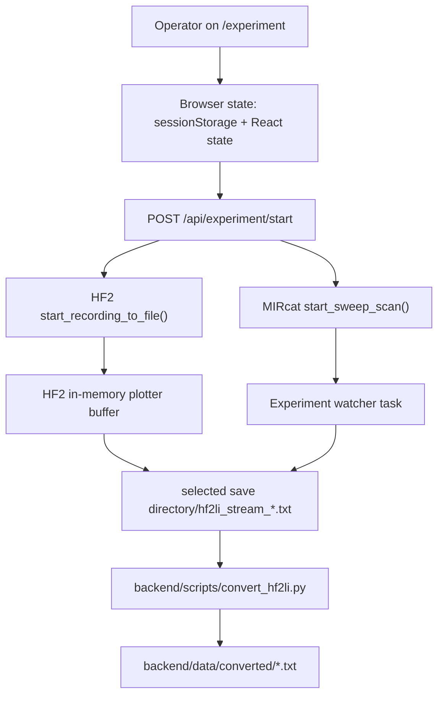

# Repository Audit

## Scope

- `Control_System` was inspected as reference-only legacy material. It was not modified.
- `ir_control_platform` remains the only valid implementation target.
- Phase 1 stays documentation-only. No package scaffolding, driver work, or UI feature work was performed.
- Classifications in this audit use `KEEP`, `REWRITE`, and `DELETE / DISCARD`.

## Current workspace state

| Repository | Current state | Evidence | Phase 1 implication |
|---|---|---|---|
| `Control_System` | Active legacy implementation with mixed UI, orchestration, persistence, and hardware logic | 75 source files across `frontend/src`, `backend/src`, `backend/scripts`, and `tools` | Use as salvage input only. Do not preserve structure. |
| `Control_System/docs` | Vendor SDKs, manuals, screenshots, and reference notes | `docs/sdks/*`, `docs/manuals/*`, `docs/gui_screenshots/*` | Strong salvage source for drivers, simulators, and validation. |
| `Control_System/data` and `Control_System/backend/data` | Real run outputs, raw captures, and converted artifacts | `data/*.csv`, `data/*.txt`, `backend/data/raw/*.txt`, `backend/data/converted/*.txt` | Primary fixture source for replay, import, processing, and e2e. |
| `ir_control_platform` | Documentation-and-boundaries skeleton only | 19 non-`.git` files, all of them repo docs, package `AGENTS.md` files, and Phase 1 docs | Phase 2 must start with contracts and scaffolding because no product code exists yet. |
| `ir_control_platform` boundary status | No implementation files to violate package rules yet | `architecture-boundary-guard` scan reported `Scanned 0 files` and `Blocking findings: 0` | Architecture is still clean, but only because implementation has not started. |
| `ir_control_platform` provenance status | No session/artifact implementation exists yet | `check_session_artifacts.py --root ir_control_platform` returned `ok: true` with no issues | Provenance rules still need actual implementation in later phases. |

## Current legacy architecture

## Top-level repository inventory

### `Control_System`

| Legacy area | Purpose today | Classification | Notes |
|---|---|---|---|
| `frontend/src` | Device-first React shell and route-owned workflows | `DELETE / DISCARD` for structure, `REWRITE` for selected requirements knowledge | Valuable only as a source of field names, status labels, and workflow nouns. |
| `backend/src/modules/daylight_mircat` | Real MIRcat SDK integration, routes, and route-local settings persistence | `REWRITE` | Highest-value hardware logic, but polluted by startup side effects and fallback branches. |
| `backend/src/modules/zurich_hf2li` | Real LabOne control, polling, plot streaming, recording, and raw node passthrough | `REWRITE` | Strong driver and data-plane source, but currently leaks LabOne internals into the UI. |
| `backend/src/modules/picoscope_5244d` | Real Pico SDK preview and autoset behavior | `REWRITE` | Preserve enum and timing knowledge; reject heuristic fallback behavior in product flow. |
| `backend/src/utils/highland_delay.py` | Shared Highland serial/TCP transport and parser | `KEEP` | Best low-level salvage candidate for delay-generator drivers. |
| `backend/src/modules/highland_t660` and `highland_t661` | Thin wrappers over shared Highland transport | `REWRITE` | Preserve channel and trigger semantics only. |
| `backend/src/modules/experiment` | Ad hoc experiment orchestration route | `REWRITE` | Best evidence for the first coordinated MIRcat plus HF2LI run sequence. |
| `backend/scripts` | One-off processing and conversion scripts | `REWRITE` | `convert_hf2li.py` contains the main scientific salvage. |
| `tools` | Command transcript and smoke runner | `KEEP` for transcript, `REWRITE` for runner | Good simulator and e2e seed material. |
| `docs`, `data`, `backend/data` | Manuals, SDKs, screenshots, raw files, converted outputs | `KEEP` | Preserve as support assets and fixtures. |
| `hardware_configuration.toml` and `start.bat` | Mixed configuration, environment assumptions, and startup behavior | `REWRITE` | Valuable as bench knowledge, harmful as-is. |

### `ir_control_platform`

| Area | Current state | Audit conclusion |
|---|---|---|
| `contracts`, `platform`, `drivers`, `experiment-engine`, `data-pipeline`, `processing`, `analysis`, `ui-shell`, `reports`, `simulators`, `e2e` | Directory placeholders plus package `AGENTS.md` files only | Package boundaries are defined, but no code exists yet. |
| `docs` | Phase 1 audit set already existed and has now been revalidated against both repositories | Keep updating in place until implementation begins. |
| Root docs | `AGENTS.md`, `REFACTOR.md`, and `PLANS.md` are present and aligned with the migration workspace rules | Enough governance exists to start Phase 2 after this audit. |

## Dependency map and hidden coupling

### Hidden coupling that must not survive migration

- `frontend/src/App.tsx` injects device providers into every route, so screen boundaries do not match workflow boundaries.
- `frontend/src/modules/Experiment/ExperimentView.tsx` owns save-path selection, start and stop decisions, timer-based finalization, device readiness checks, and part of the session naming model.
- `frontend/src/modules/DaylightMIRcat/components/LaserSettingsPanel.tsx` silently auto-corrects invalid parameters and persists mutable settings through both browser memory and `user_settings.json`.
- `frontend/src/modules/DaylightMIRcat/components/ScanModePanel.tsx` stores scan mode and multispectral state in `sessionStorage`, then starts scans directly from the view layer.
- `frontend/src/modules/ZurichHF2LI/ZurichHF2LIView.tsx` hardcodes LabOne node topology and pushes raw node reads and writes from the UI.
- `frontend/src/utils/useMemoryState.ts` creates a hidden process-global UI state store, which bypasses any typed session model.
- `backend/src/modules/experiment/routes.py` coordinates MIRcat and HF2LI directly instead of delegating to a single experiment engine package.
- `backend/src/modules/zurich_hf2li/controller.py` derives wavenumber from live MIRcat state when scan metadata is missing, creating a forbidden cross-driver dependency.
- `backend/src/modules/daylight_mircat/routes.py` and `backend/src/modules/zurich_hf2li/routes.py` both register startup auto-connect behavior, which is incompatible with explicit preflight control.

## Route map and screen inventory

| Route | Current screen | Primary panels or subviews | Hidden coupling observed | Classification |
|---|---|---|---|---|
| `/` | `DashboardView` | Device cards for Experiment, MIRcat, PicoScope, T660, T661, HF2LI, Arduino MUX, Nd:YAG | Reads device providers globally and navigates by mutating `window.location.pathname` | `DELETE / DISCARD` |
| `/experiment` | `ExperimentView` | Save Location, Sample Metadata, MIRcat Settings, HF2LI Acquisition Settings, HF2LI Data Streaming | Uses `sessionStorage`, `showDirectoryPicker`, UI timers, direct MIRcat arm/disarm calls, and `/api/experiment/start` as the run authority | `REWRITE` |
| `/daylight_mircat` | `DaylightMIRcatView` | `Tune`, `Scan`, and `Laser Settings` tabs plus status sidebar | Uses direct device commands, browser-persisted tab state, route-local settings persistence, and scan control from the page | `REWRITE` |
| `/picoscope_5244d` | `PicoScope5244DView` | Connection header, waveform preview, acquisition controls, channel cards, trigger, timebase, AWG | Owns preview loops, websocket subscriptions, autosetup entry points, and immediate-capture fallback behavior | `REWRITE` |
| `/highland_t660` | `HighlandT660View` | Status header, Trigger, Channel editor, Fire, Force EOD, raw command console | Preserves useful device semantics but exposes raw command passthrough as a normal UI affordance | `DELETE / DISCARD` as screen structure |
| `/highland_t661` | `HighlandT661View` | Same structure as T660 | Duplicate device-panel structure with raw passthrough control | `DELETE / DISCARD` as screen structure |
| `/zurich_hf2li` | `ZurichHF2LIView` | Signal Inputs, Oscillators, Demodulators table, phase-zero actions, trigger and filter controls | UI owns node map construction, polling cadence, fixed demod topology assumptions, and raw node writes | `REWRITE` |
| `/arduino_mux` | Placeholder route | Static `Coming Soon` text only | No implementation, no usable product structure | `DELETE / DISCARD` |
| `/continuum_ndyag` | Placeholder route | Static `Coming Soon` text only | No implementation, no usable product structure | `DELETE / DISCARD` |

## Device integration inventory

| Legacy integration | Real hardware reach | Current responsibility split | Reusable knowledge | First-slice position |
|---|---|---|---|---|
| Daylight MIRcat | Real SDK DLL load, connect, arm, tune, emission, sweep, step, multispectral, status, vendor error fields | Split across `DaylightMIRcatView`, `ScanModePanel`, `LaserSettingsPanel`, routes, startup hooks, and controller fallback branches | SDK load rules, call ordering, status fields, vendor fault meanings, scan parameter semantics | Include in first slice |
| Zurich HF2LI | Real LabOne connection, device discovery, node get/set, streaming, recording, timestamp normalization, phase zeroing | Split across `ZurichHF2LIView`, `HF2SettingsProvider`, routes, controller plotter buffer, file recording, and `ExperimentView` stream selection | Node-path knowledge, demod semantics, timestamp handling, file writing behavior, recording lifecycle | Include in first slice |
| PicoScope 5244D | Real Pico SDK connect, preview acquisition, autosetup heuristics, trigger and timebase mapping | Split across `PicoScope5244DView`, REST routes, preview loops, and immediate-capture fallback logic | Enum mapping, range ladder, timebase selection, capture-buffer mechanics | Exclude from first slice; revisit as expert preview path |
| Highland T660 | Real serial and TCP transport plus trigger and channel commands | Split across transport utility, thin controller wrapper, raw command route, and device panel | T560-style command grammar, parser, trigger and channel semantics | Exclude from first slice unless a hard bench dependency appears |
| Highland T661 | Same as T660 with separate config and route surface | Same structural issues as T660 | Same salvage value as T660, pending confirmation of real differences | Exclude from first slice unless a hard bench dependency appears |
| Arduino MUX and Continuum devices | Manuals only, no meaningful production code | Placeholder UI only | Planning input from manuals and wiring notes | Out of scope for the first vertical slice |

## Current data-flow map

### Data-flow observations

- The current coordinated run path is only coherent for MIRcat plus HF2LI.
- Raw HF2 output is written directly to operator-selected directories, not to an authoritative session structure.
- The HF2 recorder writes comment-prefixed metadata and CSV-like rows, but there is no session identifier, artifact manifest, or replay contract.
- Processed absorbance output exists only as a legacy script and checked-in converted files, not as a reusable pipeline package.

## Minimum viable golden path

The smallest viable first vertical slice should be the only workflow the legacy code already proves end to end: MIRcat sweep plus HF2LI acquisition.

1. `Setup`: choose a canonical experiment recipe with MIRcat scan bounds, HF2LI stream selections, and an explicit session destination.
2. `Preflight`: block on MIRcat connection and validity, MIRcat armed or tuned state, HF2LI connection, and recipe validation with explicit reasons.
3. `Run`: let `experiment-engine` start HF2LI raw capture first, then start one MIRcat sweep path. No UI timers, no UI-owned retry logic, and no fallback scan paths.
4. `Persistence`: let `data-pipeline` create a session identifier, session manifest, event timeline, device snapshots, and raw artifact registration while the run is in progress.
5. `Results`: reopen the saved session, show the raw artifact summary, and produce one deterministic processed output from the saved raw data.
6. `Out of slice`: Pico preview, Highland manual controls, Arduino MUX, Continuum devices, and any compatibility or legacy bridge behavior.

This is the recommended first slice because it is the only legacy path that already demonstrates coordinated acquisition, raw persistence, and meaningful scientific output potential.
